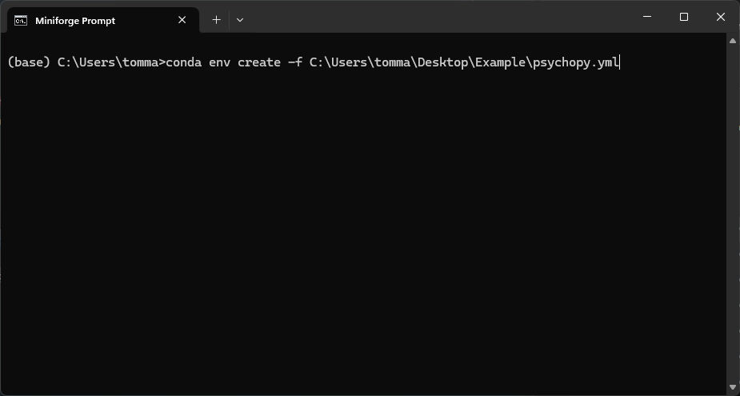

# Eye-tracking with Python (DevStart)
Wednesday, August 7, 2024, 10:30 – 17:00 by Tommaso Ghilardi & Francesco Poli

Hello hello!!! This page has been created to provide support and resources for the tutorial that will take place during the [Bridging the Technological Gap Workshop](https://www.eva.mpg.de/de/comparative-cultural-psychology/events/2024-btg2/). In particular in this folder we will cover the material and resources for the **eye-tracking** workshop!!

------------------------------------------------

Everything that will be covered in this eye-tracking workshop has been documented here: [DevStart](https://tommasoghilardi.github.io/DevStart/). Thus, if after the workshop you want to take a look please give it a go.

> [!Tip]
> In case something is not working or is not clear check this page dedicated to the workshop: [GAP](https://tommasoghilardi.github.io/DevStart/CONTENT/Workshops/GAP_2024.html).
> Feel also free to send us an email: [Tommaso](mailto:tommaso.ghilardi93@gmail.com), [Francesco](mailto:example@example.com)

 
This workshop will focus on using Python to run and analyze an eye-tracking study.

We will focus on:
-   How to implement eye-tracking designs in Python
-   How to interact with an eye-tracker via Python
-   How to extract and visualize meaningful eye-tracking measures from the raw data

## What will you need
For this workshop section you will need just few things:
- specific libraries
- files
  
We will make it as simple as possible to pass you all the material:

## Libraries
In this eye-tracking workshop we will use [Psychopy](https://www.psychopy.org/) to run a simple experiment and few more libraries to collect and process data.
We embedded everything in a nice conda environment

Just open the anaconda/miniconda terminal and write `conda env create -f` and then just drag and drop the downloaded file on the terminal. This will copy the file name with its absolute path. In my case, it looked something like this:

  

You will be asked to confirm few things (by pressing `Y`) and after a while of downloading and installing you will have your new environment for the workshop!!! It will be called `psychopy`.

Now you should find a shortcut in your start menu called **Spyder(psychopy)**, just clicking it will open spyder in our newly create environment. In case you don't see it just open again the anaconda/miniconda terminal, activate your new environment typing `conda activate psychopy` and then simply type `spyder`.

## Files
We will also make use of some files and stimuli stored in the Files folder.
------------------------------------------------
 
 <a href="https://x.com/TommasoGhi">@TommasoGhi</a> , <a href="https://x.com/FrancescPoli">@FrancescPoli</a>

[Link]: psychopy_GAP.yml

